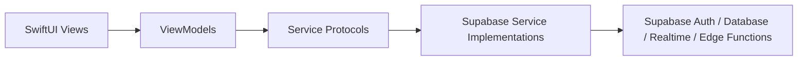
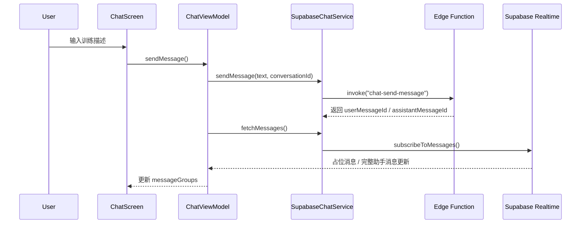

# PeakLog

PeakLog 是一个基于 SwiftUI 构建的 iOS 健身记录应用，核心思路是让用户通过自然语言描述训练内容，由 AI 解析后生成结构化训练记录

当前项目已经包含聊天记录、训练历史、个人资料与偏好设置等完整主流程，整体形态更接近一个 AI 驱动的健身日志产品原型，而不是单纯的界面 Demo。

## 项目亮点

- AI 聊天式记录训练内容，降低手动录入成本
- 将训练内容解析为结构化数据，支持动作、组数、重量、次数等信息展示
- 通过 Supabase Realtime 订阅消息状态，支持助手处理中和完成态切换
- 提供训练历史日历视图，可按日期查看训练 session
- 提供个人资料、统计数据和偏好设置入口
- 内置浅色 / 深色主题切换

## 功能模块

### 1. 认证模块

用户通过邮箱和密码完成注册、登录。认证状态由 `AuthStateManager` 统一管理，并在登录成功后自动加载默认对话。

### 2. AI 聊天记录模块

这是应用的核心入口。用户在聊天界面输入训练描述后：

1. 文本被发送到 Supabase Edge Function
2. 服务端创建用户消息与助手占位消息
3. 客户端通过 Realtime 订阅监听消息变化
4. 当助手消息处理完成后，界面更新为结构化训练卡片

### 3. 训练历史模块

历史页通过月历和日期列表展示训练情况，支持：

- 查询某个月哪些天有训练记录
- 按天拉取训练 session
- 将同一天的多条 session 聚合展示，方便回顾

### 4. 个人资料与偏好模块

个人页负责展示：

- 用户头像、昵称、会员等级
- 训练次数、连续天数、训练总量、PR 等统计信息
- 通知、深色模式、重量单位等偏好项

## 技术栈

- `SwiftUI`
- `Combine`
- `Swift Concurrency` (`async/await`)
- `Supabase Swift SDK`
- `Supabase Auth`
- `Supabase Realtime`
- `Supabase Edge Functions`

依赖版本目前锁定在：

- `supabase-swift 2.41.1`

## 项目结构

```text
PeakLog/
├── PeakLogApp.swift              # App 入口，认证态与主题注入
├── ContentView.swift             # 主容器，协调 Chat / History / Profile
├── Models/                       # 领域模型、聊天消息、历史聚合逻辑
├── ViewModels/                   # 页面状态与业务编排
├── Views/
│   ├── Auth/                     # 登录 / 注册
│   ├── Chat/                     # AI 聊天记录页
│   ├── History/                  # 日历与历史记录页
│   └── Profile/                  # 个人资料与设置页
├── Services/                     # 协议、Supabase 实现、Mock 实现
├── Supabase/                     # Supabase 配置与 client 单例
├── Theme/                        # 主题与颜色、字体管理
└── Assets.xcassets/              # 图标与资源
```

## 架构说明

项目整体采用比较清晰的分层结构，可以概括为：

- `View` 负责界面渲染与用户交互
- `ViewModel` 负责页面状态管理和业务编排
- `Service` 负责数据访问、网络请求、Supabase 查询与订阅
- `Model` 负责领域对象和数据转换

### 分层关系



### 主界面装配方式

应用入口位于 `PeakLogApp.swift`：

- 创建 `ThemeManager`
- 创建 `AuthStateManager`
- 根据认证状态切换 `AuthView` 或 `ContentView`

其中 `ContentView` 作为主容器，负责在以下页面之间切换：

- `ChatScreen`
- `HistoryScreen`
- `ProfileScreen`

### 聊天模块的数据流

聊天模块是最有代表性的业务链路：



这条链路的关键点：

- `ChatViewModel` 负责发送消息、拉取历史消息、监听 Realtime 更新
- `SupabaseChatService` 负责消息查询、函数调用和消息订阅
- `ChatMessage` 使用 `contentBlocks` 表达结构化 AI 内容
- 助手处理中的消息会显示为 typing bubble，完成后替换为正式内容

### 历史模块的数据流

历史模块由 `HistoryViewModel` 驱动：

- `activeDaysInMonth(year:month:)` 用于标记月历中有训练的日期
- `sessionsForDay(_:)` 用于加载某天的训练详情
- `WorkoutHistoryAggregator` 用于将同一天的多条 session 合并成更适合展示的历史卡片

这说明历史页并不只是直接平铺数据库返回值，而是增加了一层面向 UI 的聚合逻辑。

### 个人资料模块的数据流

个人资料页由 `ProfileViewModel` 驱动：

- `SupabaseProfileService` 同时查询 `profiles`、`user_stats`、`user_preferences`
- 页面展示资料、统计和偏好设置
- 用户修改偏好后，ViewModel 再调用 service 将变更写回 Supabase

### 依赖注入方式

当前项目使用的是较轻量的依赖注入方式：

- ViewModel 构造函数接收协议类型依赖
- 生产环境页面通常显式注入 `Supabase...Service`
- 协议层保留了 `Mock` / `Live` 实现，方便预览与后续演进

例如：

- `ChatViewModel` 依赖 `SupabaseChatService` 与 `WorkoutServiceProtocol`
- `ProfileScreen` 初始化时注入 `SupabaseProfileService`
- `MockChatService`、`MockWorkoutService`、`MockProfileService` 用于预览和开发辅助

## 核心数据模型

项目中的核心领域模型主要包括：

- `ChatMessage`: 聊天消息，包含角色、状态、文本和结构化内容块
- `ContentBlock`: AI 返回内容块，目前支持文本和训练记录块
- `WorkoutSession`: 某次训练 session
- `Exercise`: 训练动作
- `ExerciseSet`: 单组训练数据
- `UserProfile`: 用户资料、统计与偏好

这些模型集中放在 `Models/` 目录，便于 UI、ViewModel 与 Service 共用。

## 当前后端集成方式

项目已经直接接入 Supabase，主要涉及：

- `Auth`: 登录、注册、会话读取、登出
- `Database`: `messages`、`conversations`、`workout_sessions`、`profiles` 等表
- `Realtime`: 监听消息插入与更新
- `Edge Functions`: 调用 `chat-send-message` 处理 AI 消息发送与解析

Supabase Client 在 `SupabaseManager` 中以单例形式维护，配置位于 `Supabase/Config.swift`。

## 运行方式

### 环境要求

- Xcode
- iOS Simulator 或真机
- 可访问的 Supabase 项目配置

### 启动步骤

1. 使用 Xcode 打开 `PeakLog.xcodeproj`
2. 选择目标设备
3. 直接运行 App

项目当前已经在代码中配置了 Supabase URL 和 publishable key，因此默认会连接到现有后端环境。

## 测试现状

项目当前包含一些轻量级回归测试脚本，主要覆盖：

- 历史 session 聚合逻辑
- 默认 conversation 加载协调逻辑

测试文件位于 `tests/` 目录下，适合作为核心业务逻辑回归验证的起点。

## 后续可以继续演进的方向

- 将更多业务逻辑从 View 中进一步下沉到 ViewModel / Service
- 补齐更系统化的 XCTest 单元测试与 UI 测试
- 将环境配置从源码中拆分到更安全的配置管理方式
- 完善错误处理、空态展示和离线场景支持
- 补充后端表结构和接口契约文档，形成完整开发文档链路

## 总结

PeakLog 当前已经具备一个 AI 健身日志 App 的核心骨架：

- 前端以 SwiftUI 构建
- 状态管理以 ViewModel 为中心
- 数据层依赖 Supabase Auth / Database / Realtime / Edge Functions
- 页面结构清晰，模块边界明确，适合继续向生产级产品演进

如果后续需要，我也可以继续把这个 `README` 再升级一版，补上：

- 页面截图占位
- 更细的数据库表关系说明
- 更具体的本地开发 / 发布流程
- 中英双语版本
