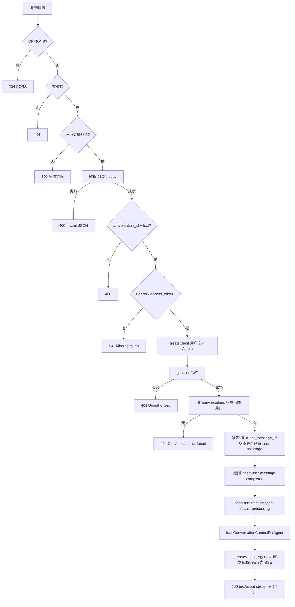
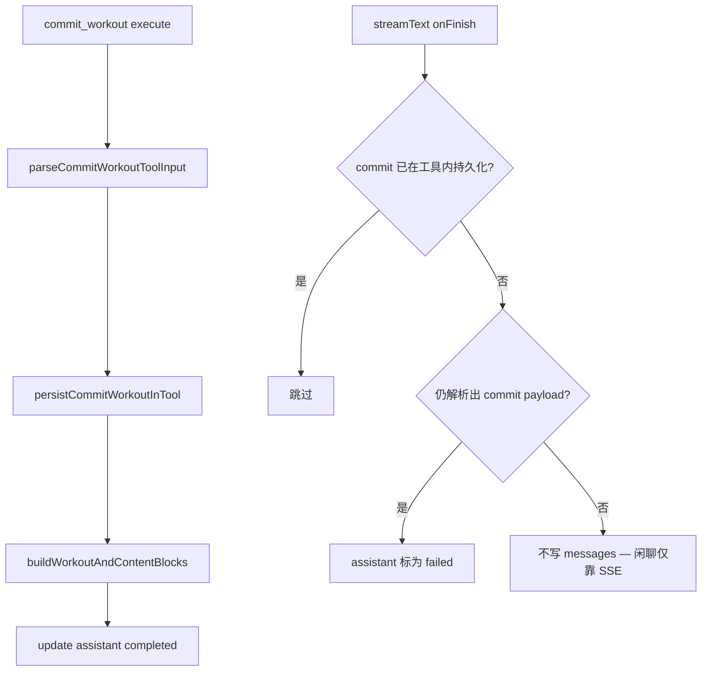
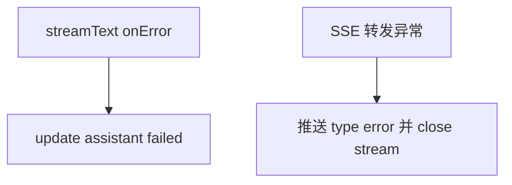
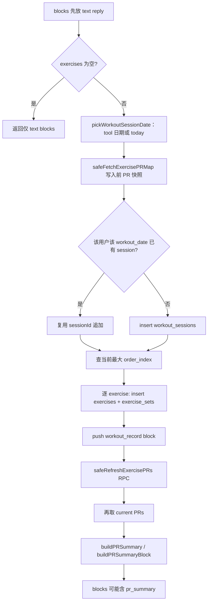

# chat-send-message Edge Function — 架构与业务流程

本文档描述 `supabase/functions/chat-send-message` 的职责、模块划分与处理流程。当前实现主入口为 `index.ts`，AI 决策入口为 `agent.ts`，schema 定义集中在 `schema.ts`。

## 1. 功能定位

该函数负责：**接收用户在某个会话里发送的聊天文本**，完成鉴权与会话校验后，**先持久化用户消息并创建一条「处理中」的助手消息**，然后对同一请求 **返回 SSE（`text/event-stream`）**。事件包括 **`text-delta`**（正文增量）、**`workout-block-stream-start` / `workout-block-delta`**（`commit_workout` 参数流式 JSON 片段）、**`workout-content-block`**（解析后的 **`WorkoutContentBlock`**，见 `stream-events.ts`，供客户端直接渲染；`exercise_id` / `set_id` 在落库前为空）、最后 **`done`**。响应头 **`X-User-Message-Id`**、**`X-Assistant-Message-Id`** 携带 UUID。模型调用 **`commit_workout`** 时，在工具 **`execute`** 内 **落库并更新助手消息**；**未调用 tool** 的闲聊 **不会** 在 `onFinish` 里写回 `messages`（助手行可仍为 `processing`，**以 SSE 文本为准展示**）。**`onFinish`** 仅在 **出现 commit 载荷但工具未成功持久化** 时将助手标为 `failed`。持久化后的 **`workout_record` / `pr_summary`** 仍以 **Realtime** 为准刷新。

## 2. 逻辑分层与模块职责

| 层级 / 模块 | 文件                                | 职责                                                                 |
| ------- | --------------------------------- | -------------------------------------------------------------------- |
| HTTP 入口 | `index.ts`                        | CORS、POST 校验、读 body、双客户端（用户 JWT + Admin）、写用户消息与助手占位、**SSE 流式响应** |
| 工具内持久化    | `index.ts`（`persistCommitWorkoutInTool`） | 由 `commit_workout` 的 `execute` 触发：`buildWorkoutAndContentBlocks` 并 `update messages` |
| SSE 契约    | `stream-events.ts`                | 导出 **`WorkoutContentBlock`** 与 `workoutContentBlockFromCommitToolInput` |
| 流后收尾    | `index.ts`（`onFinish`） | 仅当 **有 commit 意图但未持久化** 时标助手 `failed` |
| 上下文加载    | `index.ts`（`loadConversationContextForAgent`） | 最近消息 + 最近已保存训练摘要，供 agent 使用                             |
| Agent    | `agent.ts`                        | `streamWorkoutAgent`（`streamText` + `createWorkoutAgentTools`）          |
| Tools    | `tools.ts`                        | `commit_workout` 定义、`COMMIT_WORKOUT_TOOL_NAME`；`execute` 内调 `onCommitWorkout`          |
| Schema   | `schema.ts`                       | tool input 与上下文 summary 的结构定义                                     |
| 训练日期    | `schema.ts`（`pickWorkoutSessionDate`） | tool 里合法 \`YYYY-MM-DD\` 则用，否则用请求当日的 \`today\`            |
| PR 摘要   | `pr-summary.ts`                   | 对比写入前后的 PR 快照，生成 `pr_summary` 内容块                             |
| 环境      | `env.ts`                          | Supabase anon/service key 读取                                        |

## 3. HTTP 请求生命周期（同步阶段）

要点：

- **用户态客户端**：带 `Authorization`，用于 `auth.getUser`（与 RLS 语义一致）。
- **Admin 客户端**：写 `messages`、会话校验、后续后台写库（Edge 侧使用 service role）。
- `**client_message_id`**：若提供则先按 `(user_id, conversation_id, client_message_id)` 查重，避免重复 insert。

## 4. 持久化：`commit_workout` 工具内写库 + `onFinish` 收尾

补充行为：

- **只有在模型通过 tool calling 选择 `commit_workout` 时才允许写训练表**
- **普通聊天：不写 `messages` 助手终态，客户端用 SSE `text-delta` 展示**
- **不再维护 pending action，也不再生成 `clarification_prompt`**

## 5. 错误与降级

## 6. 写入训练与 `content_blocks`：`buildWorkoutAndContentBlocks`

要点：

- **同日多段对话**：同一 `user_id + workout_date` 会 **追加到已有 `workout_sessions`**，`order_index` 递增。
- **PR**：先读 `exercise_prs`，写完后尽力调用 `refresh_exercise_prs_for_user`；失败则跳过 PR 摘要块。

## 7. Agent 设计

| 步骤        | API / 能力                                   | 目的 |
| --------- | ------------------------------------------ | ---- |
| Agent | `streamText` + `tool(commit_workout)`    | `fullStream` → SSE（文本 + 流式 workout 块）；`execute` 触发落库 |

该实现不再区分“澄清工具”和“聊天工具”。tool calling 只用于危险动作边界：**写数据库**。

## 8. 外部依赖与数据表

- **DeepSeek**：环境变量 `DEEPSEEK_API_KEY`；模型 `deepseek-chat`（见 `agent.ts`）。
- **Vercel AI SDK Core**：agent 和 tool calling。
- **Supabase**：`SUPABASE_URL`、用户端 key、Service Role key（见 `env.ts`）。
- **主要表 / RPC**：`conversations`、`messages`、`workout_sessions`、`exercises`、`exercise_sets`、`exercise_prs`、`refresh_exercise_prs_for_user`。

## 9. 渲染数据来源

- **流式（SSE）**：`stream-events.ts` 中的 **`WorkoutContentBlock`**（`type: workout_record_stream`）在 **`workout-content-block`** 事件中下发，用于在落库前渲染；流式 JSON 片段见 **`workout-block-delta`**。
- **持久化后（Realtime / `messages.content_blocks`）**：`text`、`workout_record`（含真实 UUID）、`pr_summary` 等。

## 10. 小结

该 Edge Function 是 **「聊天入口 + SSE 流式 agent」**：鉴权与会话校验后写入用户消息与处理中的助手消息，再 **长连接返回 SSE**（头里带两条消息 id）；**`fullStream`** 转发 **文本增量** 与 **`commit_workout` 对应的 `WorkoutContentBlock`**；**`commit_workout` 的 `execute`** 写入训练与 PR 并更新助手消息；**未 commit** 时不写助手终态，**`onFinish`** 仅在 **commit 失败** 时标 `failed`。

---

文档与实现对应目录：`supabase/functions/chat-send-message/`。若实现变更，请同步更新本文档中的流程描述。
