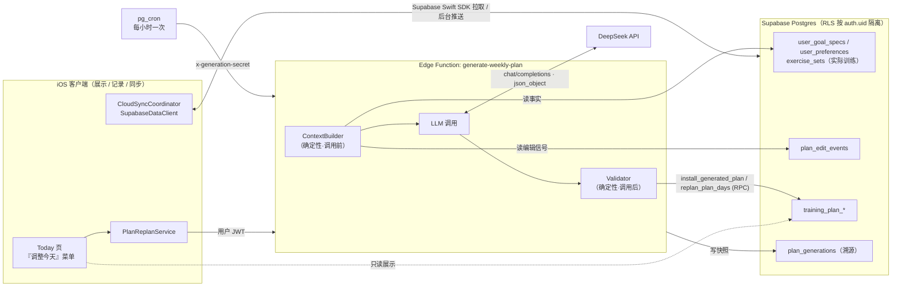
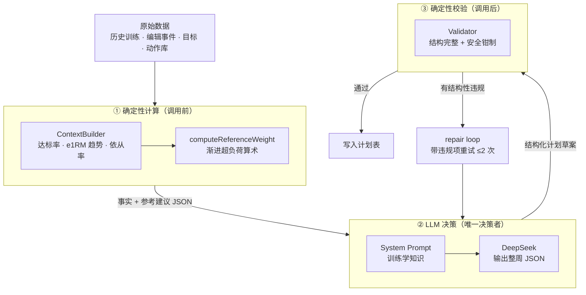
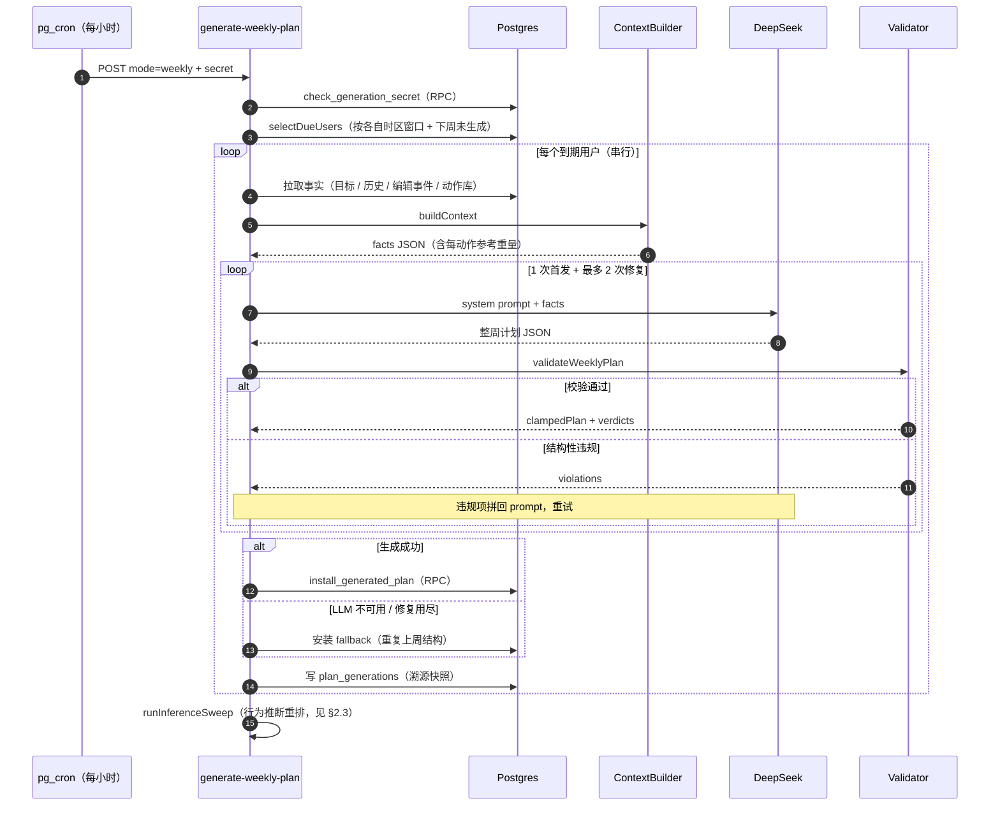
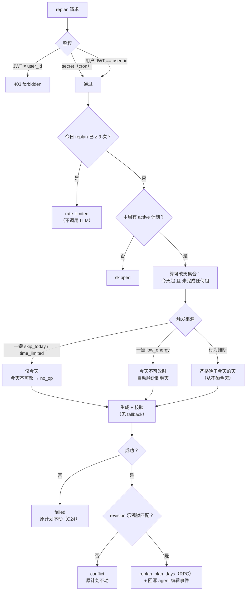
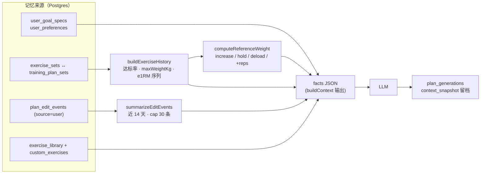
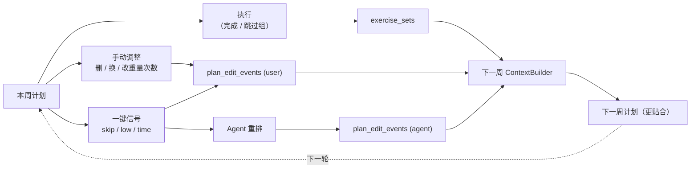
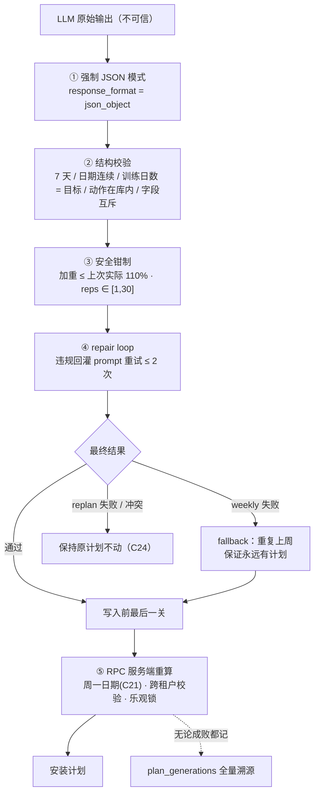
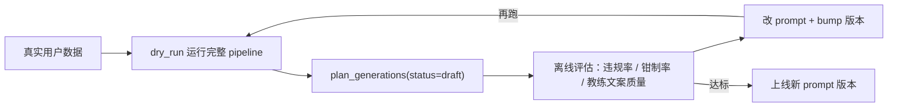

# PeakLog AI 训练计划生成：架构与设计

> 文档定位：本文档是 PeakLog **AI 计划生成子系统**的架构与设计说明，从三个视角展开——**AI 决策如何做出、记忆系统如何构成、如何保证生成动作的可靠性**。它是 `adr-001-llm-weekly-plan-generation.md`（记录"为什么这么选"的决策）的实现细节配套。
> 配套图表：本文含多张 Mermaid 架构图与流程图，GitHub / 支持 Mermaid 的阅读器可直接渲染。
> 关联文档：`adr-001-llm-weekly-plan-generation.md`（决策记录）、`system-architecture.md`（整体系统）、`api-reference.md`（表级 RLS 契约）、`docs/plans/2026-07-08-phase2-weekly-generation-plan.md` 与 `…phase3-midweek-replan-plan.md`（落地计划）。

---

## 目录

1. [概述与设计哲学](#1-概述与设计哲学)
2. [AI 决策是怎么做的](#2-ai-决策是怎么做的)
3. [记忆系统是怎么做的](#3-记忆系统是怎么做的)
4. [怎么确保 AI 生成动作的可靠性](#4-怎么确保-ai-生成动作的可靠性)
5. [关键文件索引](#5-关键文件索引)
6. [已知边界与未来演进](#6-已知边界与未来演进)

---

## 1. 概述与设计哲学

PeakLog 的 AI 计划是**服务端生成、客户端"零 UI"消费**的：核心是一个 Supabase Edge Function [`generate-weekly-plan`](../../backend/supabase/functions/generate-weekly-plan/index.ts)，背后调用 **DeepSeek** LLM。客户端从不"生成"计划，只**展示、记录、同步**。

贯穿全系统的一条主线（ADR-001 §2）：

> **LLM 做决策，确定性代码做计算，Validator 做安全兜底。**

- **LLM 是唯一的策略决策者**：排哪些动作、哪天练、是否 deload、如何压缩课表——但它**不做数字算术**。
- **确定性代码**在 LLM 前后各放一块"薄层"：调用前把历史算成事实与参考重量（ContextBuilder），调用后只做安全校验与钳制（Validator）。
- **训练学知识**（分化、恢复、渐进超负荷）全部写在 system prompt 里，改 prompt 即可升级，不用发版。

### 1.1 系统全景

### 1.2 两种生成模式

系统只有一个入口函数，但有两种模式，用途、触发者、鉴权都不同：

| 维度 | `weekly`（每周生成） | `replan`（周中重排） |
|---|---|---|
| 做什么 | 生成**下一整周**（7 天）计划 | 重写**本周剩余某几天** |
| 触发者 | 仅 `pg_cron`（服务端到服务端） | 用户一键 **或** 行为推断 |
| 鉴权 | **只认** `x-generation-secret`，永不接受用户 JWT | 用户自己的 JWT（只能改自己）**或** secret |
| 客户端可见性 | 完全不可触发（"全程零 UI"） | 一键触发 + Toast 反馈 |
| 失败兜底 | 有 fallback（重复上周） | **无** fallback，原计划保持不动（C24） |
| Prompt | `SYSTEM_PROMPT` | `REPLAN_SYSTEM_PROMPT` |

### 1.3 术语表

| 术语 | 含义 |
|---|---|
| **Agent / LLM** | DeepSeek 模型，计划的决策者 |
| **ContextBuilder** | 把原始表数据 → 喂给 LLM 的"事实 JSON"的纯函数（[`contextBuilder.mjs`](../../backend/supabase/functions/_shared/contextBuilder.mjs)） |
| **Validator** | LLM 输出的安全校验 + 钳制层（[`validator.mjs`](../../backend/supabase/functions/_shared/validator.mjs)） |
| **参考重量 (reference)** | 由确定性双渐进算法预算好、供 LLM 参考的"下一步建议"（[`referenceWeight.mjs`](../../backend/supabase/functions/_shared/referenceWeight.mjs)） |
| **溯源 (provenance)** | 每次生成写入 `plan_generations` 的完整快照 |
| **repair loop** | 校验失败时带违规项重新请求 LLM，最多 2 次 |
| **e1RM** | 估算单次最大力量（Epley 公式），用于进阶趋势 |
| **依从率 (adherence)** | 计划组中实际完成的占比 |

---

## 2. AI 决策是怎么做的

### 2.1 决策的三层分工

任何一次生成，数据都流经"计算 → 决策 → 校验"三层。**只有中间一层是 LLM**，两端都是可测试的确定性代码：

关键点：**LLM 拿到的参考重量是代码算好的建议**，它可以采纳、调整或推翻，但 prompt 明确要求它"不要忽视底层信号"（例如刚失败的动作不许加重）。加法交给代码，编排交给模型。

### 2.2 每周生成（weekly）端到端流程

**几个决策要点：**

- **谁该生成**（[`selectDueUsers`](../../backend/supabase/functions/generate-weekly-plan/index.ts)）：扫所有 profile，按**各自时区**判断是否进入生成窗口（本地周日 20:00 之后到本周结束），且下周计划尚不存在。窗口故意开得宽——漏掉一个小时的 tick，后面几个小时还能补上，而不用等一整周。
- **喂给 LLM 什么**：`buildUserMessage` 把 facts JSON 直接拼进 user message；训练学规则在 `SYSTEM_PROMPT` 里（渐进超负荷、肌群频率、deload/return week、休息日不可省、冷启动宁低勿高、把编辑事件当信号读……）。
- **LLM 调用参数**（[`llm.mjs`](../../backend/supabase/functions/_shared/llm.mjs)）：模型 `deepseek-chat`，**强制 `response_format: json_object`**，`temperature: 0.3`（低温度换稳定），60s 超时，网络/5xx 错误自动重试一次。
- **输出契约**：严格的 JSON——7 天、`dayIndex` 0–6、连续日期、非空训练日数必须等于 `goalSpec.daysPerWeek`、`exerciseId` 必须来自给定动作库、力量/有氧字段互斥、`coachSummary` 用用户语言写给用户看。

### 2.3 周中重排（replan）的决策边界

replan 复用同一条 pipeline，但 scope 缩小成"本周剩余的某几天"。它有两个触发来源，且**决策边界严格不同**：

- **一键触发**：Today 页的"调整今天"菜单，三个结构化信号——`skip_today`（跳过今天）、`low_energy`（状态不好）、`time_limited`（时间有限），定义在客户端 [`ReplanSignal.swift`](../../PeakLog/Models/ReplanSignal.swift)，原始值与服务端 `REPLAN_SIGNALS` 严格对齐。signal 的语义差异写在 `REPLAN_SYSTEM_PROMPT` 里（跳过=今天变休息、别硬补；低状态=大幅降量或转恢复；时间有限=压成约 30 分钟高价值）。
- **行为推断**：`runInferenceSweep` 在**同一个每小时 tick** 内运行，扫描本地 21:00–22:59 且"今天本该练却零完成"的用户，把落下的量重新分配到**之后的天**（`inferenceGateOpen` 是这道闸）。它直接在进程内调用 `replanForUser`，不走 HTTP。
- **客户端时序**（[`handleReplan`](../../PeakLog/Views/Today/TodayWorkoutScreen.swift)）：**先在本地记录 signal 事件**（哪怕服务端失败也要进学习闭环），再调 [`PlanReplanService`](../../PeakLog/Services/Cloud/PlanReplanService.swift)，成功后 `refresh`。返回是结构化的 `replanned / noChange / failed`，好给用户一个诚实的 Toast，而不是笼统的成功/失败。

---

## 3. 记忆系统是怎么做的

系统没有传统意义上的"向量记忆"或"对话历史"。它的"记忆"是**结构化的关系型数据 + 每次生成前的确定性汇总**。可以把它拆成几类，各有不同的来源与生命周期：

| 记忆类别 | 存储 | 作用 | 窗口 |
|---|---|---|---|
| **意图/事实记忆** | `user_goal_specs` / `user_preferences` | 目标、每周天数、时长、器械、经验、单位、语言 | 当前值 |
| **情节记忆** | `exercise_sets` ↔ `training_plan_sets`（链接） | 每个动作**实际**练了多重、多少次、是否达标 | 近 28 天 |
| **行为记忆** | `plan_edit_events` | 用户怎么改计划（删/换/加/改重量次数）= 偏好信号 | 近 14 天，最多 30 条 |
| **语义记忆** | `exercise_library` + `custom_exercises` | 允许使用的动作白名单（含用户自定义） | 全量 |
| **程序性记忆** | `computeReferenceWeight`（代码） | 把情节记忆 → "下一步该加/减/保持"的确定性建议 | 派生 |
| **审计/溯源记忆** | `plan_generations` | 每次生成的 context 快照、原始响应、校验判决、prompt 版本 | 全量留存 |

### 3.1 记忆如何汇聚成"事实"

**程序性记忆的细节**——`computeReferenceWeight` 是一套双渐进（double progression）算术：

- 上次**全部达标** → 加一档（杠铃 +2.5kg / 哑铃-类 +2kg）；
- 连续**两次**没达标 → 减载 10%（deload）；
- 只有一次没达标 → 保持、重试；
- 自重动作 → 按次数进阶（`+1~2` reps）而非加重。

这套建议**只是给 LLM 的参考**，最终数字由 LLM 决定、再由 Validator 钳制。ADR-001 的原则：**"LLM 决定，代码计算"**。

### 3.2 学习闭环

记忆不是静态的——用户每周的执行与调整会**回流**成下一周的上下文，系统因此逐周变好，**且不依赖任何模型训练**：

一个精心设计的细节：Agent 每次重排后，会把自己的结构性动作以 `source=agent` 写回 `plan_edit_events`（`recordAgentReplanEvents`，`event_type=agent_replan_day`）。这样下一周生成时，上下文里看到的是**完整的"用户发了什么信号 → Agent 做了什么"配对**，而不只是用户单方面的信号。

**衡量"记忆是否在起作用"的三个北极星指标**（ADR-001 §5）：依从率、编辑率（随周数下降 = 系统在变好）、进阶速度（主项 e1RM 斜率）。

### 3.3 客户端的一层"短期记忆"（区分）

需要与后端记忆**明确区分**的是：客户端手动记录/编辑动作时的"预设起始重量"，走的是一套**纯本地、规则化**的机制 [`SetDefaultsProvider`](../../PeakLog/Services/SetDefaultsProvider.swift)：

- 优先抄"同动作上一组"；否则查"最近一次练这个动作的那次 session"，按相同组序号取值；都没有则留空。
- 它**只是"抄上次"，不做渐进**——与后端那套 `computeReferenceWeight` 是两回事，后者目前只服务于 LLM 生成。
- 协议 `SetDefaultsProviding` 刻意设计成"历史进/建议出"，为将来替换成 LLM/渐进版预留了接口（`AppServices.setDefaultsProvider` 单点装配）。

---

## 4. 怎么确保 AI 生成动作的可靠性

可靠性不靠"相信模型"，而是**层层设防**（defense in depth）：LLM 的原始输出被当作不可信数据，逐关过滤，任何一关都可能把它拦下或修正。

### 4.1 Validator：安全校验 + 钳制（第 ② ③ 关）

[`validator.mjs`](../../backend/supabase/functions/_shared/validator.mjs) 的定位是**安全网，不是策略层**——它只挡"不安全/不合法"，绝不改写 LLM 的编排意图。

- **结构性违规**（触发 repair loop）：不是 7 天、日期不连续、训练日数 ≠ `daysPerWeek`、用了库里没有的 `exerciseId`、reps 超出 `[1, 30]`、力量动作缺重量、有氧/力量字段串味（如 cardio 带 sets、elliptical 带距离）。
- **静默钳制**（记进 `verdicts`，不算失败）：单个动作重量不得超过
  - **上次实际最大重量的 110%**（`MAX_WEEKLY_INCREASE_FACTOR = 1.10`）——有历史时；
  - 或**参考最大值的 90%**（`NO_HISTORY_CAP_FACTOR = 0.90`）——无历史时。
  - 超了就压回上限，并记录一条 `{from, to, reason}` 判决。这是防"幻觉加重"伤到训练安全的关键一关。

weekly 与 replan 共用同一个 `clampDayExercises`，保证两条路径对"什么算不安全"**永不漂移**。

### 4.2 repair loop 与 fallback（第 ④ 关）

- **repair loop**：校验失败时，把违规项列表拼回 prompt（"你上次的输出有这些问题，修好并重新返回完整计划"），最多重试 `MAX_REPAIR_ATTEMPTS = 2` 次。
- **fallback 的非对称**：
  - `weekly` **有兜底**——LLM 不可用或修复用尽时，`buildFallbackPlan` 把上周结构平移到下周，保证用户**永远有计划可练**。
  - `replan` **没有兜底**（C24）——生成失败就让原计划原封不动。因为"原计划"本身就是一个安全、合法的状态，硬塞一个可疑的重排反而更危险。

### 4.3 不让 LLM 做算术

最根本的一道保险：进阶重量由 `computeReferenceWeight` 预先算好交给 LLM 参考，**模型不需要自己做加减法**。这从源头上消除了"算术漂移"和"同输入不同输出"这两类 LLM 数字不可靠问题（ADR-001 Option B 被否的核心原因）。

### 4.4 并发、一致性与越权防护（第 ⑤ 关）

写入不是简单 `UPDATE`，而是经过服务端 RPC，把安全不变量放在**数据库这个唯一真相源**里：

- **乐观锁**：replan 的 payload 基于某个 `revision` 生成，`replan_plan_days` 带 `p_expected_revision`；若期间有人先改了计划（revision 不匹配），返回 `conflict`，**绝不覆盖赢家的改动**。
- **服务端重算关键值**（C21）：`install_generated_plan` 在 RPC 内独立重算"下周一"的日期，函数侧任何时区漂移只会导致"少生成一次"，绝不会写错周。
- **限流**：每人每天最多 `MAX_REPLAN_PER_DAY = 3` 次（一键 + 推断共享配额），且检查在**任何 LLM 调用之前**，越权刷取几乎零成本被挡。
- **跨租户隔离**：所有查询绑定 `user_id`，实际训练组通过 `fetchOwnedActualSets`（`ownershipQueries.mjs`）校验归属；客户端侧则由 RLS 按 `auth.uid()` 硬隔离（详见 `api-reference.md`）。
- **不覆盖已完成的训练**（C31）：`replan_plan_days` 在 SQL 层拒绝改写已有完成组的天，`hasCompletedSets` 只是 UI 层的提前提示，不是安全边界本身。

### 4.5 时区正确性

一个被反复强调的可靠性维度（代码注释里的 `#71`）：所有"今天 / 本周 / 生成窗口 / 每日配额窗口"都按**用户本地时区**两端推算（`localDayUtcRange` 等），不用"UTC 午夜"近似——否则每个非 UTC 用户都会按时区偏移量漂移，导致重排落到错误的日历日。

### 4.6 可观测性与安全迭代

- **溯源**：无论成功、失败还是钳制，每次生成都写一行 `plan_generations`——含 `context_snapshot`、`raw_response`、`validator_verdicts`、`prompt_version`、`engine`、`kind/trigger/signal`。任何"这计划为什么这么排"都能回溯。
- **prompt 版本纪律**：`PROMPT_VERSION` / `REPLAN_PROMPT_VERSION` 一旦改文案就必须 bump，好按版本对比生成质量。
- **dry_run**：跑完整 pipeline 但只写 `status='draft'`、**绝不安装**，用来拿真实数据安全地打磨 prompt：

---

## 5. 关键文件索引

| 文件 | 职责 |
|---|---|
| [`generate-weekly-plan/index.ts`](../../backend/supabase/functions/generate-weekly-plan/index.ts) | 入口：鉴权、选人、weekly/replan 编排、install/record |
| [`_shared/contextBuilder.mjs`](../../backend/supabase/functions/_shared/contextBuilder.mjs) | 原始行 → facts JSON（历史、达标率、编辑事件、动作库） |
| [`_shared/referenceWeight.mjs`](../../backend/supabase/functions/_shared/referenceWeight.mjs) | 确定性双渐进算术（参考重量建议） |
| [`_shared/prompt.mjs`](../../backend/supabase/functions/_shared/prompt.mjs) | `SYSTEM_PROMPT` / `REPLAN_SYSTEM_PROMPT` + 版本号 |
| [`_shared/llm.mjs`](../../backend/supabase/functions/_shared/llm.mjs) | DeepSeek 适配器（JSON 模式、超时、重试） |
| [`_shared/validator.mjs`](../../backend/supabase/functions/_shared/validator.mjs) | 结构校验 + 重量钳制（weekly & replan 共用） |
| [`_shared/ownershipQueries.mjs`](../../backend/supabase/functions/_shared/ownershipQueries.mjs) | 跨租户归属校验 |
| [`_shared/timezone.mjs`](../../backend/supabase/functions/_shared/timezone.mjs) | 本地日 ↔ UTC 区间换算 |
| [`PlanReplanService.swift`](../../PeakLog/Services/Cloud/PlanReplanService.swift) | 客户端唯一的服务端生成触发点（replan） |
| [`ReplanSignal.swift`](../../PeakLog/Models/ReplanSignal.swift) | 一键信号定义（与服务端对齐） |
| [`SetDefaultsProvider.swift`](../../PeakLog/Services/SetDefaultsProvider.swift) | 客户端本地"预设起始重量"（规则化，非 LLM） |

对应的后端单测在 [`backend/tests/`](../../backend/tests/)（`contextBuilder` / `validator` / `prompt` / `referenceWeight` / `llm` / `replan_conflict` / `timezone` / `serviceRoleOwnership` 等）。

---

## 6. 已知边界与未来演进

- **冷启动**（第一周）：只有 GoalSpec 没有历史，`isColdStart=true` 时策略是"宁低勿高、让用户往上改"，预期首周编辑率高、随后下降。
- **离线**：生成在服务端，离线时无法触发重排；但已生成的整周计划可离线查看与执行（计划提前一晚生成好，实际影响小）。
- **可换模型**：`llm.mjs` 的 `{rawText, parsed}` 返回契约让"换 LLM 供应商"只影响 Edge Function 内一处（如加 Anthropic），不影响 ContextBuilder/Validator。
- **客户端预设可升级**：`SetDefaultsProviding` 协议为把"抄上次"升级成"渐进/LLM 版起始重量"预留了替换位（见 §3.3）。
- **主观反馈**：RPE 等本期不做，但一键输入入口为其预留了扩展位（ADR-001 §2.8）。
- **指标看板**：依从率/编辑率/进阶速度的统计尚未排期（ADR-001 Action Item 5）。

---

_最后更新：2026-07-25。本文档描述的是 Phase 2/3 已落地的实现；若 pipeline 有结构性变更，请同步更新本文与 `adr-001-llm-weekly-plan-generation.md`。_
