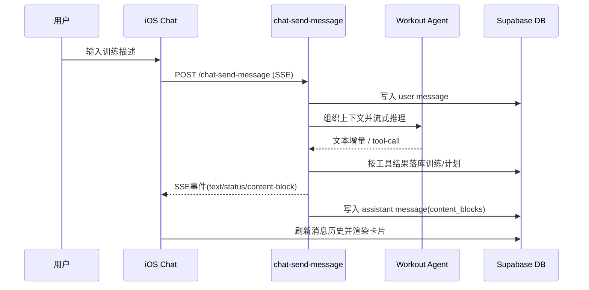
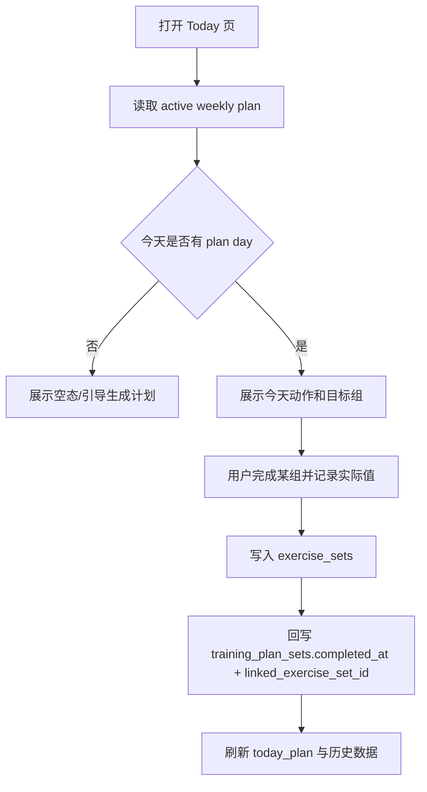
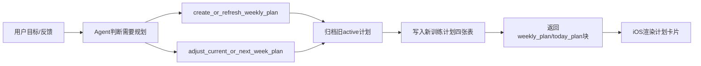

# PeakLog 业务功能流程文档

## 1. 业务域总览

PeakLog 当前主流程分为四个业务域：

- 对话记录训练（聊天主链路）
- 今日训练与计划执行
- 历史回顾（力量 + 跑步）
- 目标与偏好管理

## 2. 对话记录训练（核心主流程）

### 关键业务规则

- 用户消息先落库，确保会话完整性
- assistant 消息在流结束后一次性持久化
- 若触发 `commit_workout` / `commit_running_workout`，会生成结构化训练记录
- 若触发计划工具，返回 `weekly_plan` / `today_plan` / `plan_adjustment_summary`

## 3. 今日训练与计划执行流程

### 关键业务规则

- 计划组可被“执行映射”为真实训练组
- 同一天若已存在 `workout_session` 则追加，不重复建 session
- 计划完成状态与真实训练记录保持可追溯关联

## 4. 历史回顾流程

### 力量训练历史

1. 按月查询活跃日期（`workout_sessions`）
2. 按天查询 session + exercises + sets
3. 在 ViewModel 聚合并转为可展示结构

### 跑步训练历史

1. 按月查询活跃日期（`running_workouts`）
2. 按天读取时长和距离记录
3. 与力量记录并存展示（同日可同时出现）

## 5. 计划生成与调整流程

### 关键业务规则

- 每次刷新计划前会将现有 active 计划归档为 archived
- 新计划按结构化 `days -> exercises -> sets` 全量重建
- 计划调整必须给出 `adjustmentReason`，用于变更可解释性

## 6. 目标与偏好管理流程

- 用户在 Profile 更新目标，写入 `profiles.fitness_goal_summary`
- 偏好写入 `user_preferences`（如单位、深色模式）
- agent 在生成计划/建议时读取目标摘要参与 prompt 上下文

## 7. 异常与降级流程

- token 无效：返回 401，客户端触发鉴权流程
- tool 调用失败：assistant 消息写为 failed，返回兜底文案
- 仅文本回复（无工具）：仍可完成会话，但不写训练结构化记录

## 8. 运维关注点

- 关注 `messages`、`workout_sessions`、`training_plan_sets` 的写入成功率
- 关注 SSE 链路时延与客户端超时重试
- 对计划变更频率、计划执行率、PR 提升趋势建立指标看板
