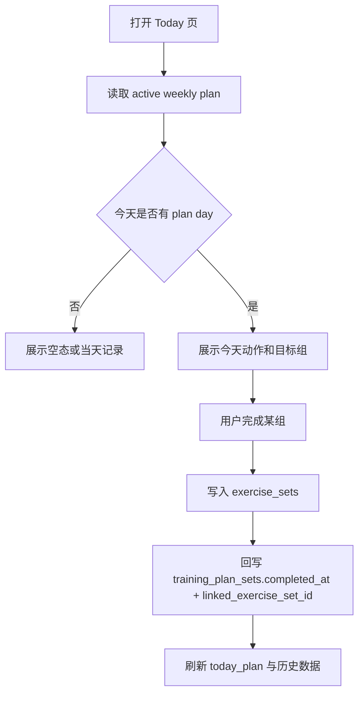
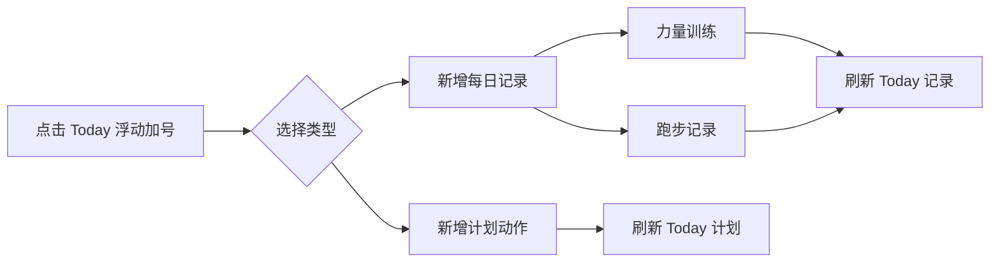
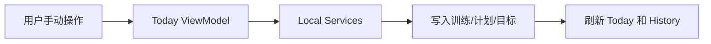

# PeakLog 业务功能流程文档

## 1. 业务域总览

PeakLog 当前主流程：

- 今日训练与计划执行
- 手动记录力量训练和跑步
- 历史回顾
- 目标与偏好管理
- 结构化 agent action

## 2. 今日训练与计划执行流程

- 计划组可被执行映射为真实训练组
- 同日力量记录和跑步记录可并存
- Live Activity 完成状态在确认训练时合并回 Today

## 3. 手动记录流程

- 手动新增计划动作直接进入当天计划
- 手动力量记录写入 session/exercise/set
- 手动跑步记录写入 running record，来源为 `manual`

## 4. 历史回顾流程

### 力量训练历史

1. 按月查询活跃日期
2. 按天查询 session + exercises + sets
3. 在 ViewModel 聚合为历史卡片

### 跑步训练历史

1. 按月查询活跃日期
2. 按天读取时长和距离记录
3. 与力量记录并存展示

## 5. 自动化动作流程

- 当前版本不保留 agent action 后端入口。
- 训练记录、计划调整、目标更新先走显式 UI 操作。
