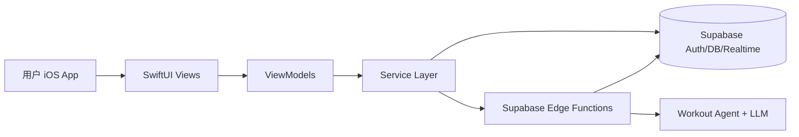

# PeakLog 系统架构文档

## 1. 架构目标

PeakLog 是一个 AI 驱动的健身助手，围绕以下核心能力构建：

- 对话式记录训练（力量/跑步）
- 7 日训练计划生成与调整
- 训练历史和计划执行跟踪
- 个人目标与偏好管理
- 基于结构化 `content_blocks` 的 GenUI 渲染

## 2. 总体架构

## 3. 分层说明

### 3.1 iOS 客户端（`PeakLog/`）

- **View 层**：`Views/`  
  负责展示和交互，不承担数据持久化逻辑。
- **ViewModel 层**：`ViewModels/`  
  负责页面状态管理、异步流程编排、业务组合。
- **Service 层**：`Services/`  
  负责 Supabase 查询、Edge Function 调用、SSE 流解析。
- **Model 层**：`Models/`  
  负责领域对象与结构化内容映射（如 `ChatMessage`、训练计划模型）。

### 3.2 后端（`backend/supabase/`）

- **Edge Functions**
  - `chat-send-message`: 会话消息主入口，SSE 流式返回 + 工具调用持久化
  - `ai-workout-action`: 今日训练动作建议与快捷操作入口（JSON 返回）
- **Postgres + RLS**
  - 核心业务数据：会话消息、训练记录、跑步记录、训练计划、用户资料
  - 多表启用 RLS，按 `auth.uid()` 做用户隔离
- **Realtime**
  - `messages` 表启用 CDC，支持消息状态实时更新

## 4. 核心模块职责

## 4.1 聊天记录模块

- iOS: `SupabaseChatService`
  - 拉取会话消息历史
  - 调用 `chat-send-message`（SSE）
  - 解析流事件更新 UI 状态
- Edge: `chat-send-message/index.ts`
  - 校验 token 与会话归属
  - 写入 user message（支持 `client_message_id` 幂等）
  - 执行 agent + tool calls
  - 持久化 assistant message 与结构化 `content_blocks`

## 4.2 训练记录模块（力量/跑步）

- 力量训练：落库到 `workout_sessions` + `exercises` + `exercise_sets`
- 跑步训练：落库到 `running_workouts`
- PR 统计：通过 `exercise_prs` + `refresh_exercise_prs_for_user` RPC 更新并回填摘要块

## 4.3 训练计划模块（7日周期）

- 数据模型：`training_plans` / `training_plan_days` / `training_plan_exercises` / `training_plan_sets`
- 能力：
  - 创建或刷新周计划
  - 调整本周/下周计划
  - 记录计划组完成（回写到真实训练记录并关联 `linked_exercise_set_id`）

## 4.4 用户模块

- 资料与目标：`profiles`（含 `fitness_goal_summary`）
- 偏好：`user_preferences`
- 统计：`user_stats`

## 5. 数据存储（核心表）

- 会话域：`conversations`, `messages`
- 训练域：`workout_sessions`, `exercises`, `exercise_sets`, `running_workouts`
- 计划域：`training_plans`, `training_plan_days`, `training_plan_exercises`, `training_plan_sets`
- 用户域：`profiles`, `user_preferences`, `user_stats`

## 6. 鉴权与安全

- 客户端通过 Supabase Auth 获取 `access_token`
- Edge Function 校验 `Bearer token`
- 关键写入使用 service-role client，在函数内执行业务校验（如会话归属）
- 数据查询依赖 RLS 实现用户数据隔离

## 7. 关键设计决策

- **SSE + 结构化块并行**：文本增量可即时反馈，结构化块可驱动稳定 UI 组件渲染。
- **工具调用主导持久化**：由 tool input 形成标准化落库路径，减少 UI/Prompt 分支复杂度。
- **计划与执行双向关联**：`training_plan_sets.linked_exercise_set_id` 让计划完成与实际训练打通。
- **幂等消息写入**：`messages(user_id, conversation_id, client_message_id)` 唯一索引避免重复发送。

## 8. 可维护性建议

- 接口字段扩展优先走 `content_blocks`，避免破坏已有 UI 解析。
- 所有新业务能力优先以 tool + schema 增量扩展，不在客户端写死规则分支。
- 变更训练计划结构时，先更新 migration 与 `schema.ts`，再改 iOS 模型映射。
