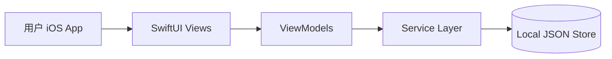

# PeakLog 系统架构文档

## 1. 架构目标

PeakLog 是个人健身助手，当前核心能力：

- 7 日训练计划展示与执行
- 力量训练、跑步记录与历史回顾
- 个人 PR、目标与偏好管理
- Today 页手动添加记录和计划动作

## 2. 总体架构

## 3. 分层说明

### 3.1 iOS 客户端（`PeakLog/`）

- **View 层**：`Views/` 负责展示和交互
- **ViewModel 层**：`ViewModels/` 负责状态管理和异步编排
- **Service 层**：`Services/` 负责本地数据访问、Edge Function 调用、Live Activity 桥接
- **Model 层**：`Models/` 负责训练、计划、历史、用户资料等领域对象

### 3.2 后端（`backend/supabase/`）

- **Postgres + RLS**
  - 后续线上持久化仍按用户隔离设计

## 4. 核心模块职责

### 4.1 Today 模块

- 展示当天计划、已记录力量训练、跑步记录
- 支持手动新增每日记录
- 支持手动新增计划动作、增删计划组、编辑重量和次数
- 支持计划训练 Live Activity 执行与完成回写

### 4.2 训练记录模块

- 力量训练：`workout_sessions` + `exercises` + `exercise_sets`
- 跑步训练：`running_workouts`
- PR 统计：由训练记录派生

### 4.3 训练计划模块

- 数据模型：`training_plans` / `training_plan_days` / `training_plan_exercises` / `training_plan_sets`
- 能力：
  - 展示 7 日计划
  - 调整计划组目标
  - 记录计划组完成并关联真实训练组

### 4.4 用户模块

- 资料与目标：`profiles`
- 偏好：`user_preferences`
- 统计：`user_stats`

## 5. 当前设计决策

- Today 页没有自然语言输入和聊天消息流
- 手动记录与计划执行是当前主路径
- agent 能力通过结构化 action endpoint 保留，不绑定聊天 UI
