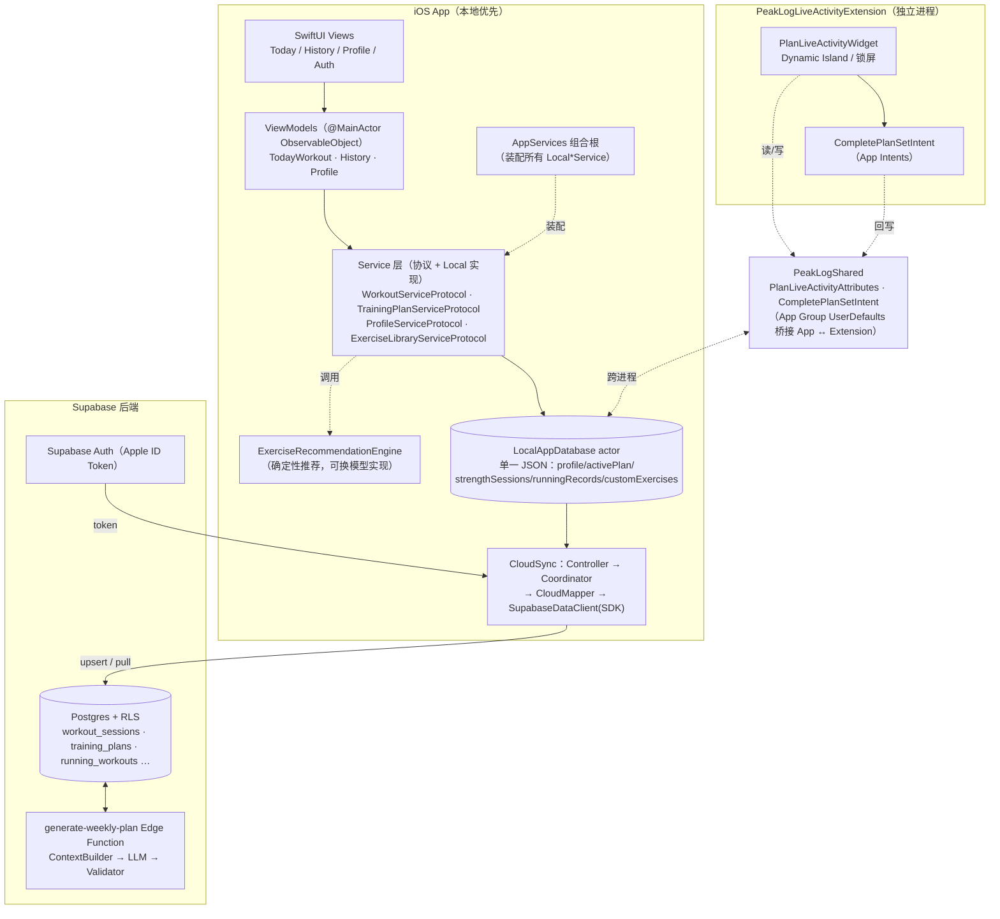

# PeakLog 系统架构与设计文档

> 文档定位：本文档是 PeakLog 的**系统架构与设计说明**，描述当前代码库的真实结构、核心模块职责与端到端数据流。
> 配套图表：文末含 Mermaid 架构图与数据流图；对话中同时给出可交互的内联架构图。
> 关联文档：`business-flow.md`（业务时序）、`api-reference.md`（接口）、`adr-001-llm-weekly-plan-generation.md`（Agent 路线）。

---

## 1. 概述

PeakLog 是一个**本地优先（local-first）的 iOS 健身助手**，采用 SwiftUI + Swift Concurrency 技术栈，核心诉求是：

- 以 **7 日训练计划** 为节点组织训练；
- 记录力量训练、跑步（有氧）与自重训练；
- 维护个人 PR、目标与偏好；
- 支持用户通过对话/显式 UI 修改计划与页面内容（**Agent 原生**理念，见 §7）。

### 1.1 当前真实形态（重要）

- **客户端架构是本地优先的**：本地持久化是单个 JSON 文件（`LocalAppDatabase` actor），首屏渲染不依赖网络。
- **云端同步通过 Supabase Swift SDK 2.53.0 访问 PostgREST**，按 `auth.uid()` 做行级安全（RLS）隔离，作为“第二份真相”。
- **计划生成 Agent 已在服务端实现**：`generate-weekly-plan` 支持每周生成与周中 replan；旧聊天页与 `ai-workout-action` 已移除。

### 1.2 技术栈

| 维度 | 选型 |
|---|---|
| 语言 / 框架 | Swift 6 模式（actor / `@MainActor`）、SwiftUI |
| 状态管理 | `ObservableObject`（ViewModel）+ `@StateObject` 环境对象 |
| 本地存储 | 单一 JSON 文件（`Application Support/PeakLog/peaklog-local-state.json`），由 `actor LocalAppDatabase` 独占访问 |
| 云端存储 | Supabase Postgres + Supabase Swift SDK（PostgREST），RLS |
| 认证 | AuthenticationServices + Supabase Swift SDK 原生 Apple 登录；DEBUG 保留程序化邮箱检查 |
| 跨进程共享 | App Group `group.com.max.PeakForm`（UserDefaults）+ App Intents |
| 实时能力 | Live Activity / Dynamic Island（Widget Extension） |
| 测试 | `PeakLogTests`（XCTest）+ `tests/`（纯逻辑回归脚本）+ `backend/tests/` |

---

## 2. 系统架构图



---

## 3. 分层与核心模块

### 3.1 表现层（SwiftUI Views）

入口 `@main struct PeakLogApp`（`PeakLog/PeakLogApp.swift`）持有四个全局环境对象：
`ThemeManager`、`LocalizationManager`、`AuthStateManager`、`CloudSyncController`。

`RootView` 依据 `auth.state` 做登录门禁（`.checking → Splash`、`signedOut → AuthView`、`signedIn/localOnly → ContentView`），并在首次云端拉取完成前（`sync.isPreparingSession`）保持 Splash，避免过期本地数据闪现。

主要屏幕：

| 屏幕 | 文件 | 职责 |
|---|---|---|
| Today（今日计划） | `Views/Today/TodayWorkoutScreen.swift` 及 `DailyRecordSheet` / `WorkoutRecordCard` / `ExerciseCardView` / `TrainingFocusComponents` | 展示当天计划、手动记录、Live Activity 训练专注模式、动作编辑 |
| History（历史回顾） | `Views/History/HistoryScreen.swift`、`CalendarGridView` | 月历 + 每日已完成训练卡片 |
| Profile（个人） | `Views/Profile/ProfileScreen.swift`、`StatCardView` | 资料、统计、偏好 |
| Auth | `Views/Auth/AuthView.swift` | Release 原生 Apple 登录；DEBUG 本地模式入口 |

根导航使用原生 `TabView(selection:)` + `HomeTab` 枚举，日历、计划、设置由系统 Tab Bar 承载；页面内流程仍主要使用 sheet（`DailyRecordSheet`、`AddPlanExerciseSheet`、`ExercisePickerScreen`、`WheelValueEditSheet`），不依赖 `NavigationStack`。

### 3.2 视图模型层（ViewModels）

三个 `@MainActor final class: ObservableObject`，依赖**协议类型**而非具体实现（`PeakLog/ViewModels/`）：

- `TodayWorkoutViewModel` — 今日计划与记录的编排，训练专注（focus）状态机。
- `HistoryViewModel` — 历史聚合（`WorkoutHistoryAggregator`）。
- `ProfileViewModel` — 资料、目标、偏好、PR。

### 3.3 服务层（Service Layer）

代码通过**协议 + Local 实现**分层，便于未来替换云端/模型实现（`PeakLog/Services/`）：

| 协议 | 本地实现 | 职责 |
|---|---|---|
| `WorkoutServiceProtocol` | `LocalWorkoutService` | 力量 session / 跑步记录 增删改 |
| `TrainingPlanServiceProtocol` | `LocalTrainingPlanService` | 7 日计划、计划动作/组 增删改、完成回写 |
| `ProfileServiceProtocol` | `LocalProfileService` | 资料 / 偏好 / 目标 |
| `ExerciseLibraryServiceProtocol` | `LocalExerciseLibraryService` | 动作库（含自定义动作） |
| `SetDefaultsProviding` | `RuleBasedSetDefaultsProvider` | 默认重量/次数建议 |
| `AuthProviding`/`TokenProviding` | `SupabaseAuthProvider` | Apple ID Token 登录、会话恢复与 token 刷新；DEBUG 邮箱检查 |
| `PlanLiveActivityManaging` | `LiveActivityManager` | Live Activity 生命周期 |

**智能化引擎（现状）**：`ExerciseRecommendationEngine` 是唯一的确定性“行为”引擎 —— 一个纯函数 `recommend(_:)`，基于肌群恢复窗口（`bigGroupRecoveryDays = 2`、`smallGroupRecoveryDays = 1`）、共现与热度给动作选择器打分。其头部注释明确：**可被模型实现替换而不影响调用方**。这是当前最接近“Agent”的组件，且是规则驱动而非 LLM。

### 3.4 本地持久化（LocalAppDatabase）

`actor LocalAppDatabase`（`PeakLog/Services/LocalAppDatabase.swift`）是**本地唯一事实来源**，持久化为单个 JSON：

```swift
private struct LocalAppState: Codable, Sendable {
    var profile: UserProfile
    var activePlan: TrainingPlan
    var strengthSessions: [WorkoutSession]
    var runningRecords: [RunningWorkoutRecord]
    var customExercises: [ExerciseDefinition]
}
```

关键特性：
- **actor 隔离**，所有读写串行化，避免并发写 JSON 损坏。
- `persist()` 后触发 `onChange` 钩子（仅在登录态由 `CloudSyncCoordinator` 安装），驱动云端推送；DEBUG 本地模式不安装该钩子，保持完全离线。
- `replaceAll(...)`（云端拉取写回）**故意不触发** `onChange`，否则每次拉取都会回弹成推送。
- 每次变更后 `recalculateDerivedProfile()` 重算派生数据：连续训练天数（streak）、总容量（volume）、各动作 PR、统计（`UserStats`）。
- `AppServices` 枚举是组合根，统一装配所有 `Local*Service` 到共享 `LocalAppDatabase.shared`。

### 3.5 云端同步（Cloud Sync）

`PeakLog/Services/Cloud/` 下的同步栈（Supabase Swift SDK）：

```
CloudSyncController          // 绑定 auth，生命周期 & 前台触发
  → CloudSyncCoordinator     // 防抖/合并推送、安装 onchange 钩子
    → CloudMapper            // 本地快照 ↔ 后端行（pushBundle / deleteNotIn）
      → SupabaseDataClient   // SDK select/upsert/update/delete（受 RLS 约束）
```

- **推送方向**：本地变更 → `LocalAppDatabase.onChange` → 防抖 `requestPush` → `CloudMapper.pushBundle` → SDK upsert/update，再用 scoped `deleteNotIn` 清理已删行。
- **拉取方向**：登录后首次全量拉取 → merge 到本地快照，保留离线与跨端记录，派生字段重算。
- 所有 Database/Function 调用先通过 `TokenProviding.validToken()`；token 不可用时不发送请求。
- RLS 保证每行只属于当前 `auth.uid()`。

### 3.6 跨进程共享（Extension ↔ App）

`PeakLogShared/`（编译进主 App 与 Widget 扩展两份）：

- `PlanLiveActivityAttributes.swift` — `ActivityAttributes` + `ContentState`（当前动作、组序号、目标负荷/次数、完成计数），并提供 `contentState(for:completedSetIDs:focusedExerciseID:)` 构造器。
- `CompletePlanSetIntent.swift` — `LiveActivityIntent`，允许从**锁屏**直接“完成动作”，系统路由回主 App 进程。

二者通过 **App Group `group.com.max.PeakForm` 的 UserDefaults**（`PlanLiveActivitySharedStore`）在 App ↔ Extension 之间传递“已完成组 id / 当前聚焦动作 id”。`PeakLogLiveActivityExtension/` 是独立 Widget 进程，仅负责渲染 Dynamic Island / 锁屏视图与“完成动作”按钮。

### 3.7 后端（Supabase）

`backend/supabase/migrations/*.sql`（11 个迁移）定义 Postgres 表，全部 RLS 隔离到 `auth.uid()`：

- 用户：`profiles` / `user_preferences` / `user_stats`（由触发器维护派生统计）。
- 训练：`workout_sessions` / `exercises` / `exercise_sets`（力量）、`running_workouts`（兼容命名的通用有氧表，含活动类型、时长和可选距离；旧 RPE 字段仅保留兼容读取）。
- 计划：`training_plans` / `training_plan_days` / `training_plan_exercises` / `training_plan_sets`。计划条目以 `item_type` 区分力量/有氧；有氧条目直接保存类型与目标指标，并通过 `linked_cardio_workout_id` 关联实际记录。
- 历史遗留（当前客户端未使用）：`conversations` / `messages` / `attachments` / `parse_tasks` / `parse_results` / `conversation_pending_actions` —— 这些是旧聊天/解析管线的产物，当前版本已不再走该路径。
- PR：`exercise_prs`，以及自定义动作字段。

`backend/supabase/config.toml`：`project_id = "peaklog-core"`，Postgres 17，Realtime 开启，Apple OAuth 客户端 `com.max.PeakLog`，`deno_version = 2`。

### 3.8 Agent / 智能化

详见 `docs/architecture/adr-001-llm-weekly-plan-generation.md` 与 `ai-plan-generation.md`。要点：

- **服务端**每周（`pg_cron`）生成计划，无聊天 UI —— “AI 在后台工作”。
- **LLM 是唯一的决策方**，被两层确定性“薄层”约束：
  - `ContextBuilder`（LLM 前）：聚合事实（每组完成度、达标率、e1RM 趋势、本周编辑事件流、坚持率、`GoalSpec`、预计算的“参考下一步重量”）。
  - `Validator`（LLM 后）：仅做安全校验（动作必须存在于库、周负荷增幅 ≤ 上周实际的 110%、schema 完整、天数与 `GoalSpec` 一致），失败则重新请求 LLM（repair loop）。
- **训练科学写在 system prompt 里**，改 prompt 即可升级行为，无需发版。
- 用户的计划编辑以 **`PlanEditEvent` 事件流**保存（而非仅最终态）；每份生成计划携带**溯源**（prompt 上下文快照、model + prompt 版本）。
- 客户端：`TrainingPlanExercise.aiSuggestion` / `previousPerformanceSummary` / `progressionMode` 是 Agent 填充的字段，`coachSummary` 是人类可读的“AI 教练”理由。

---

## 4. 核心数据结构

### 4.1 本地状态根（`LocalAppState`）

| 字段 | 类型 | 说明 |
|---|---|---|
| `profile` | `UserProfile` | 资料、目标、偏好、PR、派生统计 |
| `activePlan` | `TrainingPlan` | 当前 7 日计划 |
| `strengthSessions` | `[WorkoutSession]` | 力量训练记录 |
| `runningRecords` | `[CardioWorkoutRecord]` | 通用有氧记录；字段名保留以兼容旧本地 JSON |
| `customExercises` | `[ExerciseDefinition]` | 自定义动作库 |

### 4.2 7 日计划模型（`Models/TrainingPlanModels.swift`）

`TrainingPlan → TrainingPlanDay → TrainingPlanExercise → TrainingPlanSet`。`TrainingPlanExercise.itemType` 为 `.strength` 时使用计划组；为 `.cardio` 时使用活动类型、目标时长和可选距离，并以一次完成作为一个进度单位。计划与真实训练的关键关联：

```swift
struct TrainingPlanSet: Identifiable, Codable, Equatable, Sendable {
    let id: String
    var setIndex: Int
    var targetWeight: Double?
    var targetWeightUnit: WeightUnit
    var targetReps: Int
    var completedAt: Date?
    var linkedExerciseSetId: String?   // 计划组 → 真实 ExerciseSet 的关联
    var isCompleted: Bool { completedAt != nil || linkedExerciseSetId != nil }
}
```

`linkedExerciseSetId` 把“计划组”绑定到一次真实记录组，是完成度追踪与历史回写的支点；删除动作或记录时会级联清理孤儿记录（`removeLoggedSets` / `clearPlanCompletionLinks`）。

### 4.3 领域模型

`WorkoutSession`/`Exercise`/`ExerciseSet`（力量）、`CardioWorkoutRecord`（通用有氧，`source: .agent / .manual`）、`ExerciseDefinition`（动作库，稳定 slug + 中英文别名 + `MuscleGroup`/`Equipment`/`ExerciseLoadType`）、`UserProfile`/`UserStats`/`UserPreferences`/`ExercisePR`。

---

## 5. 数据流

### 5.1 记录一次训练（力量）

1. UI（`DailyRecordSheet` / `WorkoutRecordCard`）调用 `TodayWorkoutViewModel.addStrengthRecord(_:)`。
2. ViewModel 调协议 `workoutService.createStrengthSession(StrengthSessionDraft)`。
3. `LocalWorkoutService` → `LocalAppDatabase.createStrengthSession(...)`：追加 `WorkoutSession`，`recalculateDerivedProfile()` 重算 PR/统计，`persist()` 写 JSON 并触发 `onChange`。
4. `CloudSyncCoordinator` 防抖推送 → `CloudMapper.pushBundle` → `SupabaseDataClient.upsert` 到 `workout_sessions/exercises/exercise_sets`，RLS 隔离到当前用户。

### 5.2 修改计划 / 页面内容

- **显式编辑**：`TodayWorkoutViewModel.updatePlannedSet / addPlannedExercises / deletePlannedExercise / reorderTodayPlanExercises / addLoggedSet / updateLoggedSet / deleteExercise` → 对应 `TrainingPlanServiceProtocol` / `WorkoutServiceProtocol` 方法 → `LocalAppDatabase` 变更 → 同 §5.1 的持久化 + 云推送路径。`AddPlanExerciseSheet` 直接打开统一运动选择器；力量动作进入多组表单，有氧分类进入时长/距离表单。
- **Agent 重排**：Today 页记录结构化 signal 后由 `PlanReplanService` 调用 `generate-weekly-plan` 的 replan 模式；服务端应用 revision guard，成功后客户端 pull 最新计划。
- 计划组完成会把 `TrainingPlanSet.linkedExerciseSetId` 关联到真实 `ExerciseSet`，并反向清理孤儿记录。

### 5.3 生成 7 日计划

- **本地兜底**：首次启动 `LocalAppDatabase.makeSeedState()` 仍提供固定 7 日模板，保证未登录或云端计划尚未到达时可用。
- **服务端生成（ADR-001 已实施）**：`pg_cron` 周级生成 → `ContextBuilder` 聚合事实 + 参考下一步重量 → LLM 输出整周结构化 JSON → `Validator` 钳制负荷与校验 schema/动作库成员 → 违规则 repair 重请求 → RPC 写入 `training_plan_*` 并记录溯源；客户端通过同步拉取结果。

### 5.4 云端同步方向

- **上行（push）**：本地变更 → `onChange` → 防抖 `requestPush` → `pushBundle`（upsert + `deleteNotIn`）。
- **下行（pull）**：登录后首次 `replaceAll(...)`（重算派生，不触发 `onChange`）。

### 5.5 Live Activity 完成回写（跨进程）

锁屏“完成动作”按钮 → `CompletePlanSetIntent.perform()`（App Intents，系统路由回主 App）→ 经 App Group UserDefaults（`PlanLiveActivitySharedStore`）持久化“已完成组 id” → 主 App 进程读取并更新 `TrainingPlanSet.completedAt` / `linkedExerciseSetId`，并刷新 `PlanLiveActivityAttributes.ContentState`。

---

## 6. 关键设计决策

1. **本地优先 + 单一 JSON actor**：首屏零网络依赖；`actor` 串行化所有读写，避免并发损坏；派生数据（PR/统计/streak）每次变更重算，保证 UI 与真相一致。
2. **协议化服务层**：ViewModel 只依赖协议，调用方不受 Local/Cloud/模型实现切换影响（`ExerciseRecommendationEngine` 注释承诺“可换模型实现而不改调用方”）。
3. **派生数据内联重算**：`recalculateDerivedProfile()` 是唯一派生真相来源，云端拉取也走它，避免重复统计接口。
4. **计划组 ↔ 真实训练组的关联**：`linkedExerciseSetId` 使完成度可溯源、可清理，是历史回写与孤儿清理的支点。
5. **`onChange` 仅登录态安装、pull 不触发 push**：保证离线本地模式零副作用，且拉取不会回弹成推送。
6. **App Group 跨进程桥接**：Live Activity 扩展与主 App 通过 UserDefaults 共享最小状态，避免进程间复杂通信。
7. **Agent 决策集中在服务端**：客户端不保留聊天流水线，只发送结构化 replan signal 并消费计划；`generate-weekly-plan` 以 prompt、ContextBuilder、Validator 和 RPC 为控制面。

---

## 7. 当前架构缺口 / 路线图

| 项 | 状态 | 说明 |
|---|---|---|
| LLM 周计划生成 | 已实施 | 服务端 `ContextBuilder → LLM → Validator` 管线、`PlanEditEvent` 事件流、计划溯源 |
| 客户端 Agent 入口 | 未实现 | `ExerciseRecommendationEngine` 仍是确定性规则；无对话/自然语言改计划 |
| 历史聊天/解析表 | 遗留未用 | `conversations/messages/parse_*` 等表当前客户端不写入，待清理或复用 |
| Edge Function 运行时 | 已实施 | `generate-weekly-plan` 承担 weekly 与 replan；旧 `ai-workout-action` 已移除 |

> 维护约定（见 `docs/architecture/README.md`）：数据结构/行为变化须同步更新本文档；接口字段变化须同步 `api-reference.md`；新增跨模块能力须先补架构与流程图再进入开发。
