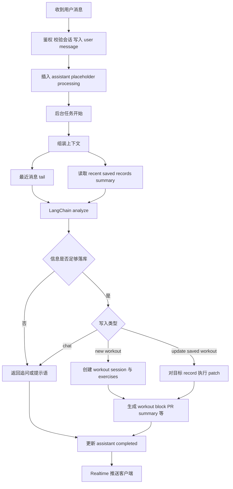
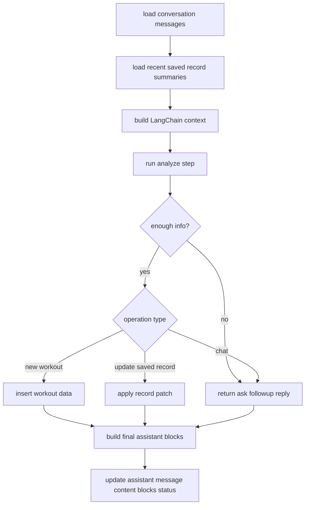

# Context-Driven LangChain Workout Chat Design Draft

**Goal:** 将当前 `chat-send-message` 从“硬编码澄清规则 + 专用 pending action”重构为“完全上下文驱动的 LLM 决策后端”，使系统不再维护任何中间草稿或专用澄清状态，而是由大模型基于会话上下文直接判断当前信息是否足够落库，是否需要继续追问，以及用户是在新建训练还是修改既有训练。

**Architecture:** 保持当前“iOS 发送消息 -> edge function 持久化消息 -> 后台异步处理 -> Realtime 更新 assistant 消息”的大链路不变；重构 `peaklog-core` 内部的澄清与落库机制，移除 `clarification.ts` 和 `pending action` 思路，改为基于 `LangChain` / `LangGraph` 的 analyze-first 流程。系统每轮只读取上下文、调用大模型分析、再根据分析结果执行数据库操作。

**Tech Stack:** Supabase Edge Functions, Deno, TypeScript, Supabase Postgres, Realtime, LangChain or LangGraph, LLM structured output

---

## Scope Decision

- 本次是后端架构设计草案，不直接改代码
- 主改动范围在 `peaklog-core`
- `PeakLog` iOS 客户端只需要后续按新的 block / record 协议适配展示
- 当前 `pending action + clarification` 视为待删除方案
- 不引入 `active draft` 或其他中间草稿状态

## Why Change

当前方案适合处理“经典力量训练缺重量”这一类问题，但不适合作为长期的 chatbot 核心架构，原因包括：

- 澄清逻辑依赖硬编码规则，扩展新能力时分支会快速膨胀
- `clarification.ts` 聚焦于重量补全，不适合覆盖补组数、改动作、改日期、删除记录等通用编辑需求
- 用户的真实表达天然是开放式的，对话产品不应把大量业务能力固化为几个枚举分支
- 大模型已经具备较强的指代消解、意图识别和自然语言结构化能力，适合承担“理解层”
- 前端已经提供编辑重量和编辑组数能力，因此后端可以接受少量识别误差，而优先追求自然对话体验

目标不是继续扩充后端规则，而是把系统从“规则驱动”调整为“模型分析驱动，系统只负责执行”。

## Design Principles

- LLM 负责理解：识别用户意图、缺失信息、目标对象和操作类型
- 系统负责执行：读取上下文、写入数据库、更新消息状态、做幂等和审计
- 不保留任何中间训练草稿状态
- 上下文由聊天记录和最近已保存记录摘要组成
- 错误容忍由前端编辑能力兜底：识别不准时允许用户低成本修正

## Target Capability Model

未来后端应支持以下统一能力，而不是为每种情况单独写规则：

- 新建一条训练记录
- 基于上下文补充上一轮未说完的信息
- 修改刚刚保存的训练记录
- 给已有训练追加动作或组数
- 改日期、改重量、改 reps、改 sets
- 识别普通聊天，不触发训练写入

这些能力都应通过统一的 LLM 决策入口进入后端，而不是继续扩展 `clarify_weight` 之类的专用状态。

## Proposed State Model

本方案不保留任何中间草稿。后端只依赖以下业务对象：

- `conversation messages`
  - 原始聊天消息，继续作为对话上下文和审计记录存在
- `recent saved records`
  - 最近 1 到 3 条已保存训练记录的结构化摘要
  - 用于支持“修改上一条记录”“给刚才那条补一组”等自然表达
- `assistant execution result`
  - 当前这轮 assistant 最终决定执行的动作及其结果

关键变化：

- 不再围绕“有没有待补重量”建模
- 不再保存“未完成训练草稿”
- 改为让 LLM 直接从上下文判断当前这句是在新建、补充还是修改

## Context Assembly Strategy

新的上下文应优先提供“与当前决策最相关的内容”，而不是无限扩大聊天窗口。每轮调用 LLM 时，建议按以下顺序组装上下文：

1. 当前用户消息
2. 最近 6 到 10 条自然语言消息
3. 最近 1 到 3 条已保存训练记录摘要
4. 当前日期、用户时区、用户默认单位等环境信息

设计重点：

- 最近消息是主上下文
- 最近已保存记录只提供摘要，不提供整库信息
- 让模型判断当前消息是对话延续、信息补充还是记录修改

## LLM Decision Contract

这里不定义字段名，只定义决策语义。每轮模型需要输出三类信息：

- 当前用户意图是什么
  - 普通聊天
  - 信息不足，需要继续追问
  - 可以提交新训练
  - 修改已保存记录
- 它操作的目标对象是什么
  - 无目标对象
  - 新训练
  - 某条最近已保存记录
- 当前信息是否足够执行数据库副作用
  - 可以保存
  - 需要继续追问
  - 无需写库
- 给用户展示的自然语言回复是什么

系统只根据这个统一决策入口做分支，不再根据“是不是卧推、是不是缺重量”去写死业务判断。

## Execution Guardrails

虽然改成 LLM-first，但后端仍然需要保留执行护栏：

- 只有当模型明确认为信息足够时，系统才允许真正写库
- 如果目标对象不明确，优先返回追问，而不是直接写库
- 如果模型输出与上下文冲突，优先降级为 ask-followup，而不是冒险写错数据
- 所有写入动作都需要可审计，能知道本轮是创建、修改还是补全
- 最近保存记录的修改应优先通过 patch 语义执行，而不是整条重建

这些护栏不是为了压制模型能力，而是为了约束数据库副作用。

## LangChain Execution Model

本方案建议用 `LangChain` 或 `LangGraph` 来组织后端执行，而不是继续手写大量分支判断。

推荐采用一个极简的 analyze-first agent 流程：

- `load_context`
  - 读取最近消息和最近已保存训练摘要
- `analyze`
  - 调用大模型，判断当前信息是否足够落库
  - 判断当前是在新建训练、修改记录，还是普通聊天
- `execute`
  - 如果可以落库，则执行数据库操作
  - 如果信息不足，则只返回追问文案
- `finalize`
  - 更新 assistant 消息与前端展示 block

这里的重点不是做一个会自主规划很多工具的复杂 agent，而是把“分析 -> 执行”这条链路显式编排出来。

## End-to-End Flow

## Main Business Flow Breakdown

### 1. 普通聊天

- 模型判断当前消息不属于训练落库范围
- 后端仅更新 assistant 文本
- 不创建草稿，不修改记录

### 2. 新训练但信息还不够

- 模型识别为训练相关，但认为尚不足以落库
- assistant 返回追问或确认当前已理解的信息摘要
- 等待用户下一轮补充

### 3. 新训练且信息足够

- 模型识别为可直接提交的新训练
- 后端将结构化结果写入 workout tables
- assistant 返回最终确认，并带结构化 block

### 4. 用户补充上一轮未说完的信息

- 模型直接从最近上下文判断用户本轮是在补重量、补 reps、补 sets 或改动作
- 若补全后已满足提交条件，则直接落库
- 若仍不完整，则继续追问

### 5. 用户修改已保存记录

- 模型结合最近已保存记录摘要，判断目标是某条已提交 workout
- 系统执行 patch 式更新，而不是强制新建一条训练
- assistant 返回修改确认

## Recommended Backend Pipeline

## Migration Direction

建议按两阶段迁移：

### Phase 1

- 保留当前消息处理总框架
- 将 `clarification.ts` 替换为 LangChain analyze / execute 模块
- 移除重量白名单、动作类型硬编码、`clarify_weight` 专用逻辑
- 移除 `pending action` 与任何草稿状态逻辑
- 引入统一的 LLM 决策结果

### Phase 2

- 增加“修改最近已保存训练记录”的能力
- 对 recent saved records 提供摘要上下文
- 后端支持 patch 语义更新训练记录
- 逐步扩展更多聊天能力，而不是继续写专用分支

## Risks

- 纯 LLM 决策会增加偶发误判，必须依赖前端编辑能力做最终纠正
- 如果 recent saved records 摘要不足，模型可能把修改目标指错
- 如果 prompt 和上下文装配设计不好，模型会出现“知道在聊训练，但不知道该提交还是追问”的摇摆
- 如果执行护栏过弱，模型误判会直接污染训练数据
- 完全不保留中间草稿意味着某些跨轮补充场景会更依赖最近上下文窗口的稳定性

## Success Criteria

- 后端不再依赖固定动作名单来决定是否追问
- 对话中可以自然支持补重量、补组数、修改训练等更多场景
- 上下文核心是“最近消息 + recent saved records”
- 系统仍然能稳定控制数据库副作用
- iOS 端即使遇到误识别，也能通过已有编辑入口完成修正

## Open Questions

- 修改已保存记录时，是否只允许作用于最近一次提交
- patch 更新是否需要保留版本历史
- followup 回复是否继续通过结构化 block 呈现，还是退回成纯文本
- 最近消息窗口长度是否需要按模型上下文自动调整
- recent saved records 摘要中是否要包含最近一次 assistant 回复内容

## Recommendation

推荐采用“Context-driven LangChain analyze-first”的方案：

- 去掉当前重量专用的澄清规则和 pending action 状态机
- 不保留任何 draft
- 让 LLM 基于上下文统一决定追问、保存、修改和聊天
- 用 LangChain 或 LangGraph 显式组织 `analyze -> execute` 链路
- 保留执行护栏与可审计数据库操作

这条路线既符合 chatbot 产品形态，也能在未来能力扩展时避免继续堆积硬编码业务分支。
